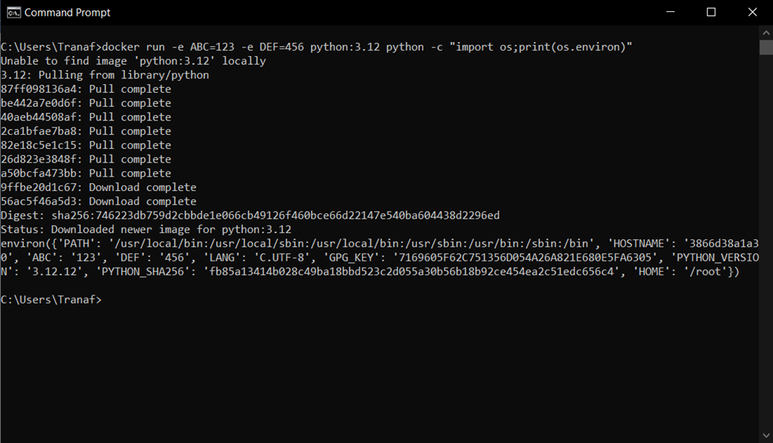

Docker là nền tảng phần mềm giúp chạy và deploy ứng dụng sử dụng các container.

Docker đóng gói phần mềm thành các container tiêu chuẩn hóa, chứa đựng tất cả những dependency cần thiết để chạy phần mềm như thư viện, môi trường runtime, package hệ thống.

Các container độc lập với nhau.

Container vs VM (Virtual machine - máy ảo)

- Điểm tương đồng: tính độc lập, kiểm soát.

- VM mô phỏng toàn bộ một hệ thống -> chậm, tiêu tốn nhiều tài nguyên.

- Container chỉ chứa những thành phần cần thiết nhất để chạy ứng dụng -> nhanh hơn, sử dụng ít tài nguyên.

Lợi thế của Docker:
- Dễ ứng dụng.

- Nhẹ và nhanh.

- Khả năng mở rộng tốt.

- Hiệu suất cao.

- Dễ dàng quản lý dependency.

Một số khái niệm liên quan:

- Docker Daemon: là server Docker quản lý các image, container, network và volume.

- Docker Client: cho phép người dùng tương tác với Docker Daemon bằng command trong terminal.

- Docker Volume: là phần dữ liệu được tạo ra khi container được khởi tạo.

- Docker Registry: nơi lưu trữ riêng của Docker Image. Image được push vào registry và client sẽ pull image từ registry. Có thể sử dụng registry riêng hoặc từ các nhà cung cấp dịch vụ cloud như AWS, Azure, Google Cloud…

- Docker Hub: là registry lớn nhất cho Docker Image.
  
- Docker Repository: là tập hợp các Docker Image cùng tên nhưng khác tag.

- Docker Networking: cho phép kết nối các container với nhau. Kết nối này có thể trên 1 host hoặc nhiều host.

- Docker Compose: công cụ cho phép chạy ứng dụng với nhiều container dễ dàng hơn, cho phép config các command trong file docker-compose.yml để sử dụng lại.

- Docker Swarm: để phối hợp triển khai container.

- Docker Service: là container trong production. 1 service chỉ chạy 1 image.

**Docker Image**: là một thành phần quan trọng trong hệ thống Docker, đóng vai trò như một mẫu chuẩn chứa tất cả các thành phần cần thiết để chạy ứng dụng. Cụ thể, một image bao gồm mã nguồn, các thư viện, dependency và cấu hình cần thiết cho ứng dụng. Các đặc điểm chính của Docker Image:

- Read-only: không thể thay đổi. Khi khởi tạo một container từ 1 image, Docker sẽ tạo một lớp ghi đè (write layer) lên lớp image đó.
  
- Tầng: một image được xây dựng từ nhiều tầng khác nhau. Mỗi thay đổi trong Dockerfile tạo ra 1 tầng mới. Tầng này giúp tiết kiệm dung lượng và tối ưu hóa bởi nếu nhiều container cùng sử dụng một image, các tầng giống nhau chỉ cần lưu trữ một lần.
  
- Môi trường nhất quán: Docker image đảm bảo ứng dụng chạy chính xác trong mọi môi trường, từ phát triển đến production.
- Image là template cho container, chỉ định hệ thống file, users, command default, môi trường… cho container. Container là nhóm process được tạo ra dựa theo hướng dẫn của image. Có thể có nhiều container chạy cùng 1 image.
  
- Một image sẽ được build dựa trên dockerfile.

**Dockerfile** là file config cho Docker để build ra image. Nó sử dụng 1 image cơ bản để xây dựng lớp image ban đầu (một số image cơ bản là python, ubuntu, alpine). Sau đó nếu có các lớp bổ sung thì nó sẽ được xếp trùng lên lớp cơ bản.

Các config:
- FROM: chỉ định image gốc (python, ubuntu…)

- LABEL: cung cấp metadata cho image. Có thể sử dụng để add thông tin maintainer. Để xem các label của image, chạy lệnh docker inspect.

- ENV: thiết lập biến môi trường.

- RUN: có thể tạo một lệnh khi build image, được sử dụng để cài đặt các package vào container.

- COPY: sao chép các file và thư mục vào container

- ADD: thêm các file và thư mục vào container.

- CMD: cung cấp một lệnh và đối số cho container thực thi. Các tham số có thể được ghi đè và chỉ có một CMD.
- WORKDIR: thiết lập thư mục đang làm việc cho các chỉ thị khác như: RUN, CMD, ENTRYPOINT, COPY, ADD…

- ARG: định nghĩa giá trị biến được dùng trong lúc build image.

- ENTRYPOINT: cung cấp lệnh và đối số cho một container thực thi.

- EXPOSE: khai báo port lắng nghe của image.

- VOLUME: tạo một điểm gắn thư mục để truy cập và lưu trữ data.

**Những lệnh docker cơ bản:**

docker run hello-world: lệnh cơ bản để kiểm tra trạng thái hoạt động của docker

- Kiểm tra xem image hello-world có tồn tại trên máy hay ko.
- Nếu không thì pull từ repo library/hello-world trên Docker Hub
- Docker tạo và chạy container
- In ra message và ngừng chạy container.

Note: có thể chạy docker run -rm hello-world để xóa container sau khi chạy

docker run &lt;tên image&gt;: chạy container từ 1 image.

- docker run -p hostport:containerport image: port mapping cho container
- \-d: detach, chạy container trong background
- \--name: đặt tên cho container

docker pull &lt;tên image&gt;: pull image từ docker hub về máy

Note: docker có quyền root.

docker image/container ls: hiển thị danh sách image container

- \--digest: hiển thị digest - một đoạn mã hóa chỉ tới phiên bản của image

docker ps: hiển thị danh sách container đang chạy

- \-a: hiển thị danh sách tất cả container

docker logs &lt;tên container/container ID &gt;: xem log của container

docker stop &lt;tên container/container ID&gt;: dừng container

- docker stop $(docker ps –a –q): dừng mọi container

docker container prune: xóa tất cả container đang không hoạt động

docker rm $(docker ps –a –q): xóa tất cả container

docker run nginx:1.27.0-bookworm : tag trỏ tới một phiên bản image nhất định

- docker run nginx@&lt;digest&gt;: tương tự

docker run -e ABC=123 -e DEF=456 python:3.12 python -c "import os;print(os.environ)"

- \-e: khai báo biến môi trường
- \-c: chạy code được truyền dưới dạng string

docker pull python:3.12-slim: pull về phiên bản gọn nhẹ hơn của image

docker pull python:3.12-alpine: phiên bản gọn nhẹ hơn, được phát triển cho distro alpine

docker exec -it &lt;containerid&gt; /bin/bash: truy cập terminal của container

- \-i: interactive, cho phép tương tác với bash
- \-t: tty, terminal

docker run -v mydata:/data python:3.12 python -c "f='/data/data.txt';open(f, 'a').write(f'Ran!\\n');print(open(f).read())"

- v: mount data vào image để các container có thể sử dụng.
- Các loại mount:
  - Volumes: -v mydata:/path/in/container
  - Bind-mount: -v ./mydata:/path/in/container; -v /mydata:/path/in/container
  - Tempfs mount:

**Kết thúc 28/01.** Tìm hiểu về docker, tải và chạy Docker Desktop. Pull image nginx và python và chạy container.