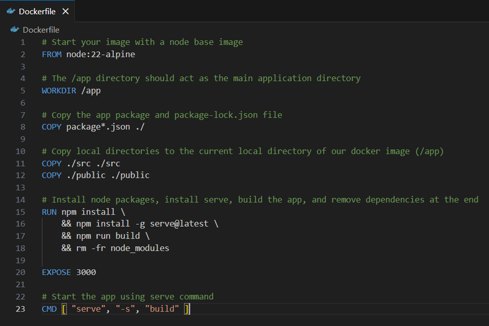

<h3 align="center" style="font-weight: bold">Dockerfile:</h3>

Ví dụ của một dockerfile (cho một ứng dụng React cơ bản)

Giải thích chi tiết:

FROM node:22-alpine
  - Sử dụng node.js phiên bản 22.
  - alpine: một distro linux gọn nhẹ
  - image này có đủ node.js, Alpine Linux và npm để quản lý package và build ứng dụng.
WORKDIR /app
  - Tạo directory /app nếu directory không tồn tại.
  - Chọn directory này là default để thực hiện RUN, COPY và CMD
COPY package\*.json ./
  - Copy các file chứa thông tin về dependency trước.
COPY ./src ./src
COPY ./public ./public
  - Copy source code và asset của ứng dụng vào /app.
RUN npm install \\

&& npm install -g serve@latest \\

&& npm run build \\

&& rm -fr node_modules

- Chạy các lệnh cần thiết để build và chạy ứng dung.
    - npm install: tải về các dependency cần để build ứng dụng
    - npm install -g serve@latest: tải serve (một file server nhỏ gọn)
    - npm run build: chạy script build ứng dụng trong package.json
    - rm -fr node_modules: xóa dependency sau khi build ứng dụng để tiết kiếm dung lượng image

EXPOSE 3000: container chạy ở port 3000

CMD \[ "serve", "-s", "build" \]

  - Command được chạy khi khởi động container
  - Chạy server file serve, chế độ single page application và thư mục của serve.

<h3 align="center" style="font-weight: bold">Docker Compose:</h3>

Docker Compose: công cụ giúp chạy nhiều container cùng 1 lúc để tạo thành một ứng dụng hoàn chỉnh (VD: CSDL + back-end + front-end)

VD: repo <https://github.com/docker/multi-container-app>

**Dockerfile:**

ARG NODE_VERSION=19.5.0

- Định danh phiên bản nodeJS sử dụng.

FROM node:\${NODE_VERSION}-alpine

- Sử dụng image nodeJS dành cho distro alpine.

ENV NODE_ENV production

- Set môi trường node sang production, đảm bảo khi build ứng dụng sẽ kiểm tra file .env

WORKDIR /usr/src/app

- Set thư mục /usr/src/app là thư mục default để chạy RUN, COPY và CMD

RUN --mount=type=bind,source=package.json,target=package.json \\

&nbsp;   --mount=type=bind,source=package-lock.json,target=package-lock.json \\

&nbsp;   --mount=type=cache,target=/root/.npm \\

&nbsp;   npm ci --include=dev

- Mount package.json và package-lock.json kiểu bind, tạm thời, không lưu vào image layer. Nếu mã nguồn thay đổi mà dependency không đổi thì cache docker vẫn giữ nguyên, không phải load lại dependency.
- Mount cache /root/.npm, giúp cho những lần build sau lần đầu nhanh hơn.
- npm ci -include=dev: tải dependency cho dev tool.

RUN npm install -g nodemon

- Tải nodemon để có thể thực hiện hot reload, khi thay đổi source code thì sẽ phản ánh vào kết quả build trong thời gian thực.

COPY . .

- Copy hết file của project vào /usr/src/app

RUN  chown -R node /usr/src/app

USER node

- node là một user có sẵn trong image nodeJS
- chown chuyển quyền sở hữu của file project sang user node
- chạy ứng dụng dưới user node để đảm bảo tính an toàn và bảo mật

EXPOSE 3000

- chạy ứng dụng ở port 3000

CMD npm run dev

- chạy ứng dụng ở chế độ dev

**File compose:**

services:

&nbsp; todo-app:

&nbsp;   build:

&nbsp;     context: ./app

&nbsp;   depends_on:

&nbsp;     - todo-database

&nbsp;   environment:

&nbsp;     NODE_ENV: production

&nbsp;   ports:

&nbsp;     - 3000:3000

&nbsp;     - 35729:35729

&nbsp;   develop:

&nbsp;     watch:

&nbsp;       - path: ./app/package.json

&nbsp;         action: rebuild

&nbsp;       - path: ./app

&nbsp;         target: /usr/src/app

&nbsp;         action: sync

&nbsp; todo-database:

&nbsp;   image: mongo:6

&nbsp;   #volumes:

&nbsp;   #  - database:/data/db

&nbsp;   ports:

&nbsp;     - 27017:27017

Định nghĩa 2 container: todo-app là container nodeJS và todo-database là container MongoDB. 2 container này chạy cùng một network Docker nên có thể giao tiếp với nhau.

Phần của container nodeJS

build:

context: ./app

- build image sử dụng hướng dẫn trong Dockerfile trong ./app

depends_on:

\- todo-database

- Đảm bảo rằng container todo-database khởi động trước.

environment:

NODE_ENV: production

- Inject NODE_ENV=production khi bắt đầu ứng dụng, bắt ứng dụng chạy trong chế độ prod.

ports:

\- 3000:3000

\- 35729:35729

- port của host map với port của container.
- port của dependency hot reload.

develop:

watch:

\- path: ./app/package.json

action: rebuild

\- path: ./app

target: /usr/src/app

action: sync

- Khi có thay đổi tại package.json (tức thay đổi về dependency), dựng lại image và container.
- Cập nhật lại vào file source code của ứng dụng.

Container MongoDB:

image: mongo:6

- Định danh phiên bản image của MongoDB

ports:

\- 27017:27017

- port của MongoDB

Lệnh trong Docker (bổ sung)

docker build -t welcome-to-docker: build image và container từ một dockerfile

- \-t: đặt tên cho image

docker compose up -d: build và chạy các service được liệt kê trong file compose

**Kết thúc 29/01/2026.** Tìm hiểu thêm về docker file, docker compose. Format lại báo cáo thành dạng .md và phân báo cáo thành từng file theo ngày.

<h3 align="center" style="font-weight: bold">Volume</h3>

Volume: cho phép lưu lại output hay data do container tạo ra. 
