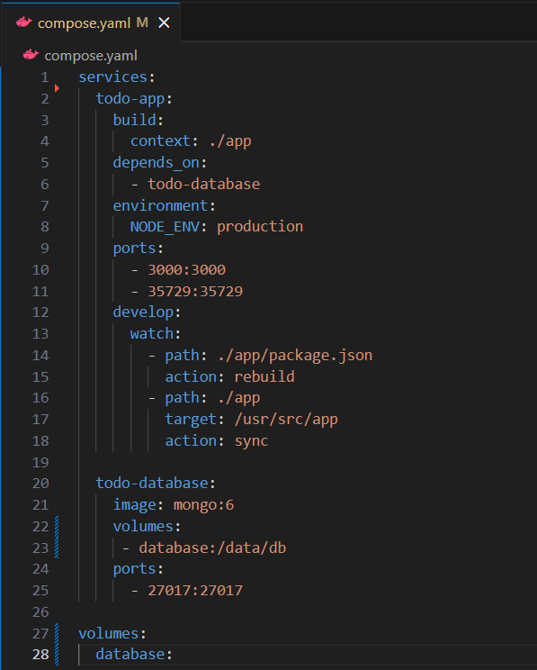
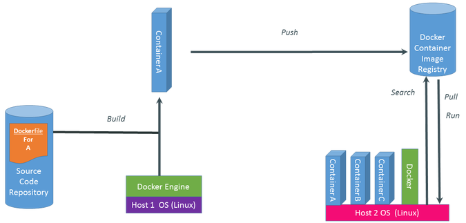
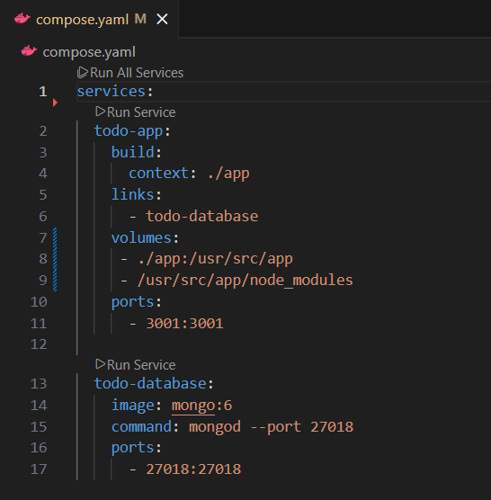
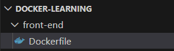
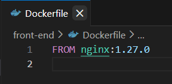
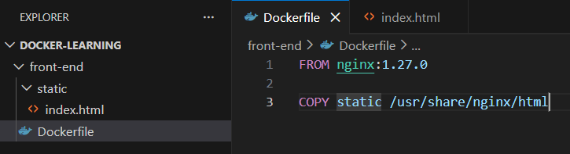

<h3 align="center" style="font-weight: bold">Volume</h3>

Volume: cho phép lưu lại output hay data do container tạo ra. 

Tiếp tục sử dụng ví dụ repo <https://github.com/docker/multi-container-app>

File compose đã có thêm phần liên quan tới volumes.

todo-database:

Volume ở trong todo-database: Compose sẽ mount volume có tên database trong thư mục /data/db trong container để phục vụ cho service todo-database.

Volume ở ngoài: định nghĩa và config một volume có tên database để những service khác được liệt kê trong file Compose sử dụng.

Khi xóa container, data vẫn lưu lại ở image.

**Bổ sung thêm lệnh Docker**

docker logs &lt;tên container&gt;: show log của một container

docker build -t &lt;tên container&gt;: build 1 image từ container

docker start &lt;tên container&gt;: start 1 container đã tạo

docker tag docker/welcome-to-docker YOUR-USERNAME/welcome-to-docker: đổi tên image

<h3 align="center" style="font-weight: bold">Quy trình thực thi của một hệ thống sử dụng Docker</h3>

**Build**: Đầu tiên tạo một dockerfile trong thư mục của mã nguồn để hướng dẫn Docker build ứng dụng. Sau khi build sẽ có được image và container chứa ứng dụng kèm những dependency cần thiết.

**Push**: Sau khi có được container, có thể thực hiện push container này lên cloud và lưu tại đó.

**Pull và Run**: Nếu một máy tính khác muốn sử dụng container này thì bắt buộc máy phải thực hiện việc pull container về máy có cài đặt Docker Engine và thực hiện run container.

<h3 align="center" style="font-weight: bold">Persistence Storage (Volume và Bind-mounts)</h3>

docker run python:3.12 python -c "f='/data.txt';open(f, 'a').write(f'Ran!\n');print(open(f).read())"

Lệnh tạo một container chạy image python 3.12 và một đoạn code thực hiện chương trình tạo file data.txt và viết "Ran!" vào file đó rồi in ra nội dung của file.

Mỗi lần chạy lại lệnh thì sẽ tạo container và file mới, bắt đầu lại từ đầu.

docker run -v mydata:/data python:3.12 python -c "f='/data/data.txt';open(f, 'a').write(f'Ran!\n');print(open(f).read())"

Data được lưu lại bằng volume ở một thư mục và có thể được sử dụng lại ở các container sau.

Volume: 

- Mới hơn, nhiều chức năng hơn và được quản lý hoàn toàn bởi Docker Engine.

- Sử dụng syntax -v mydata:/path/in/container; Sử dụng relative path.

- Phù hơp cho môi trường production.

- Không phụ thuộc vào hệ thống file của máy host, container không cần access host.

- Dễ dàng chia sẻ qua lại giữa các container.

- Có thể sử dụng remote storage hoặc cloud storage.

Bind-mounts:

- Cũ hơn, ít chức năng hơn, mount file hoặc thư mục của máy chủ vào container.

- -v ./mydata:/path/in/container hoặc -v /mydata:/path/in/container; Sử dụng absolute path.

- Tiện lợi trong quá trình phát triển ứng dụng.

- Có thể nhanh chóng chỉnh sửa file ở máy host. (Có thể là vấn đề bảo mật)

- Note: có thể mount readonly: -v ./mydata:/path/in/container:ro

Thêm ví dụ về bind-mount: repo https://github.com/docker/bindmount-apps

Project này thực hiện bind-mount thư mục local ./app vào /usr/src/app trong container của service todo-app. Dòng thứ 2 /usr/src/app/node_modules ngăn không cho bind-mount ghi đè lên mục node_modules của container để bảo toàn các package và dependency đã cài đặt trong container.

<h3 align="center" style="font-weight: bold">Xây dựng custom image</h3>

Ví dụ tạo custom image

Tạo thư mục cho project và tạo file Docker

Để build image và đặt tên cho image: docker build -t dockerlearning . (có thể thêm -f kèm path của dockerfile)

Thực hiện serve file html: tạo một file html static và cập nhật dockerfile

Thực hiện copy nội dung trong thư mục static vào thư mục đựng html của nginx. Khi build và chạy image sẽ có container đang serve file html này.

<h3 align="center" style="font-weight: bold">Layers (Lớp)</h3>

Image được tạo thành bởi các layer. Mỗi command sẽ tạo ra một layer mới cho image.

Các image không thể thay đổi được, kể cả hoạt động xóa cũng tạo ra layer mới.

Khi build, Docker sẽ kiểm tra so sánh với các layer đã cache ở trước và sử dụng lại nếu những layer ở trước vẫn hợp lệ với layer cần build => Tránh việc build lại layer không cần thiết, tối ưu thời gian và tài nguyên khi build.

VD: trong ví dụ ở trên, nếu thay đổi phiên bản nginx thì sẽ phải build lại layer đó, và tất cả các layer sau nó.

<h3 align="center" style="font-weight: bold">Docker Init</h3>

docker init: command chạy trong thư mục của project để dựng các dockerfile và file compose cần thiết.
